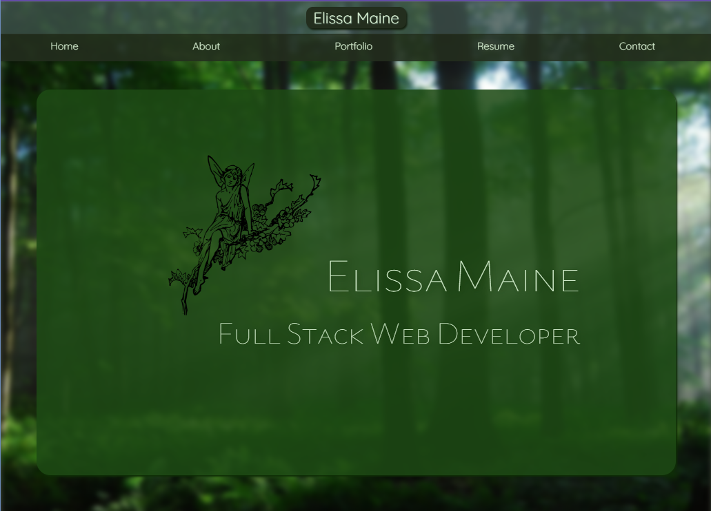
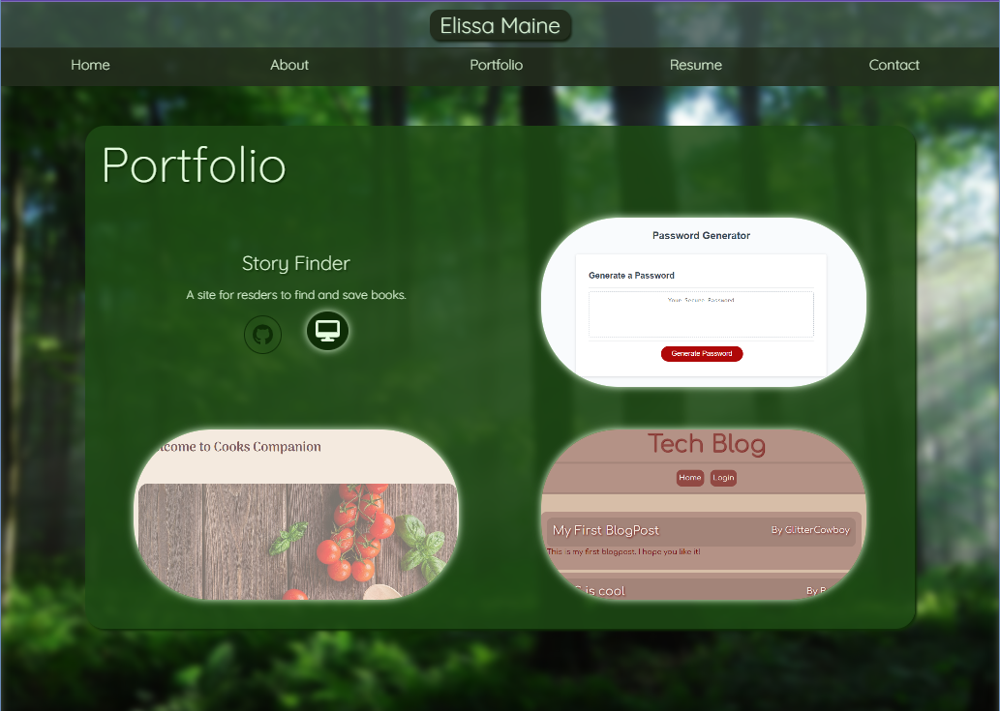
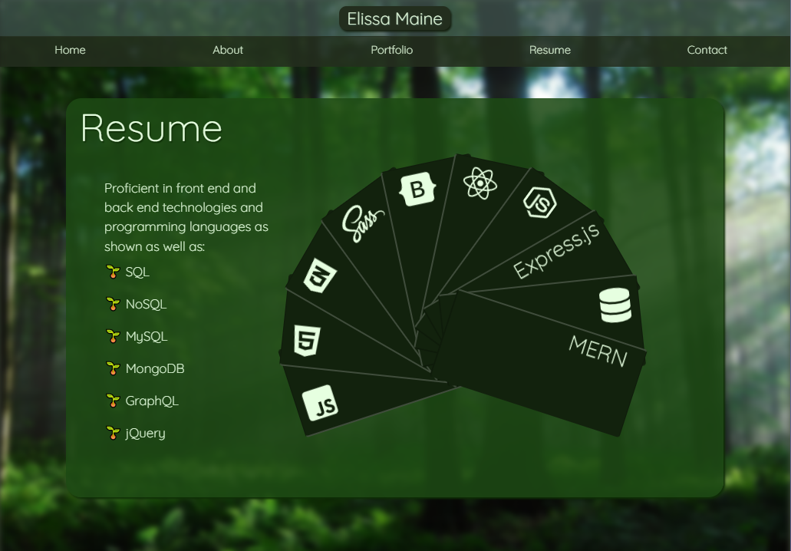

# Elissa Maine Portfolio
  

  ## Description

  This portfolio showcases my skills and all that Ive learned through out the bootcamp by putting all the projects im most proud of in a single spot. I created this porfolio using react and I decided to try and learn sass to style it. 

  ## Table of Contents

  - [Sources and References](#sourcesandreferences)
  - [Images](#Images)
  - [Link to Portfolio](#LinktoPortfolio)
  - [Questions](#questions)

  ## Sources and References 

  - Slobodan react Portfolio
       - [Portfolio Website](https://bobangajicsm.github.io/portfolio/index.html)
       - [Repo](https://github.com/bobangajicsm/react-portfolio-website)
       - [Youtube Video](https://www.youtube.com/watch?v=ESHaail1eGc)
  - [Sass](https://sass-lang.com/)
        - [Youtube Videos](https://www.youtube.com/watch?v=_kqN4hl9bGc&list=PL4cUxeGkcC9jxJX7vojNVK-o8ubDZEcNb)
  - Animations and Effects
       - [Used Color Fan as a reference for my skills animation](https://codepen.io/nitishkmrk/pen/jyYEop)
       - [Animate.css](https://animate.style/)
       - [Font Awsome icons](https://fontawesome.com/search?q=box&o=r&m=free)
  - [EmailJs](https://www.emailjs.com/)  
       -[Tutorial to set up contact page functionality](https://hackernoon.com/integrating-a-contact-form-with-emailjs-in-react)

  ## Images
  

  

  

  ## Link to Portfolio

  [Link to deployed Portfolio](https://elissamaine.github.io/ElissaMaine-Portfolio/#home)

  ## Questions

  If you have any questions please contact the project creator at: emaine97@yahoo.com
  And check out more that they have done on their GitHub account at: elissamaine

  Thank You!